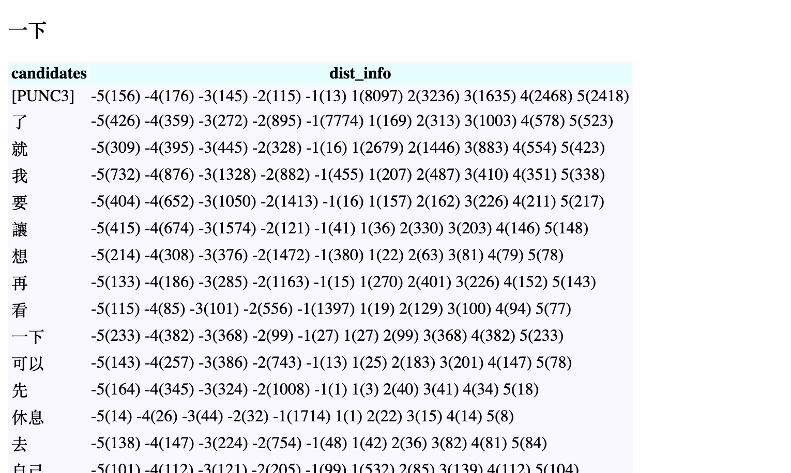

Demo Project - FastAPI with SQLite
=======================
Useful Links:  

 + [FastAPI](https://fastapi.tiangolo.com)
 + [FastAPI with Database](https://fastapi.tiangolo.com/tutorial/sql-databases/)
 + [FastAPI with templates](https://fastapi.tiangolo.com/advanced/templates/)
 + [Jinja Documente](https://jinja.palletsprojects.com/en/2.11.x/templates/)

Steps
------------
 1. Download database and put it under `${FastAPI-sample}/data/` folder  
 2. Install dependencies (fastAPI+uvicorn)  
    `pip install -r requirement.txt`
 3. Run the API  
    `./run.sh`
 4. Open browser and send GET request (return JSON)  
    `https://localhost:8000/search?word={word}`  
 5. Check HTML output (render with HTML)  
    `https://localhost:8000/show-html?word={word}`

Demo
------------
1. browser: `http://localhost:8000/search?word=[PERSON]&limit=5`  
     
2. browser: `http://localhost:8000/search?word=%E4%BD%8F%E5%AE%85&limit=10`  
     
3. browser: `http://localhost:8000/show-html?word=一下&limit=10`  
     
